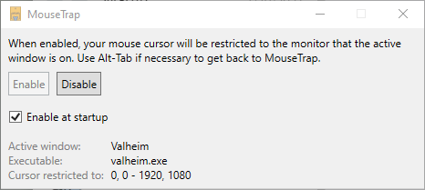

# MouseTrap

Some games don't capture the mouse cursor properly and let it escape to other monitors, where clicking will cause the game to lose focus.

The game that caused me to develop MouseTrap was Valheim, although some older games have the same issue and it should work equally well for those.

MouseTrap does one thing; it keeps the cursor within the bounds of the monitor where the active window is located. You can of course still use Alt-Tab to switch between windows. Disable or close MouseTrap to release the cursor.

